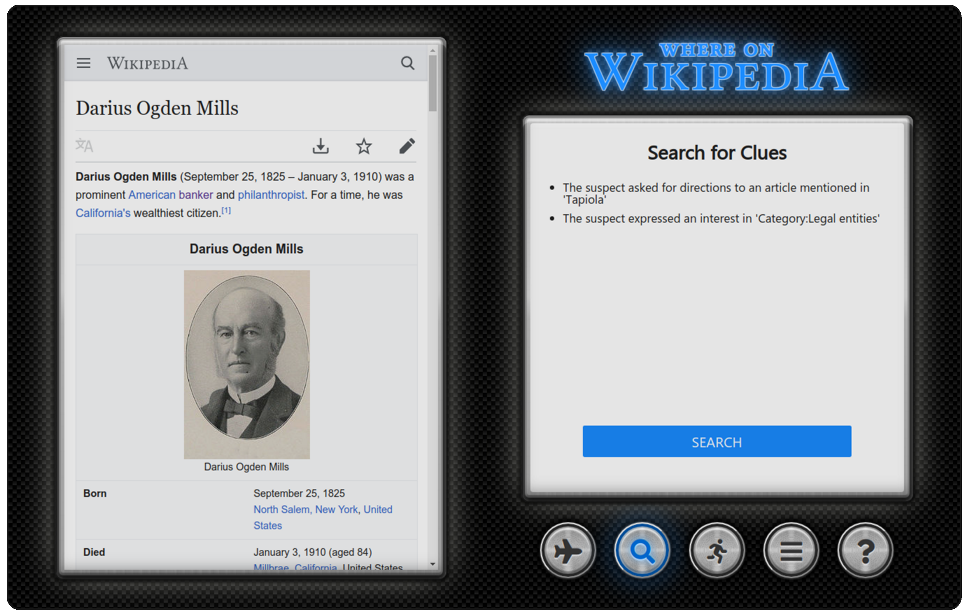

# Where on Wikipedia

As our final project for the [Lighthouse Labs](https://www.lighthouselabs.ca) web development bootcamp, we chose to recreate the classic Carmen Sandiego games - where they came with a desk encyclopedia or almanac, however, we've decided to make use of a slightly more modern source.

## Usage

### The Easy Way
-placeholder-

### The Hard Way

- Install MongoDB. I won't even try to offer instructions on how to do that.
- Clone this repository
- Using `.env.example` as a guide, create a `.env` file in the project's root directory. Change appropriate variables to match
- `npm install`
- `npm run seed` to create the database and example game.
- `npm start`
- Direct your browser to [http://localhost:3000](http://localhost:3000), replacing the port (3000 here) with whatever you have the server running on.

## Dependencies

- Node.js
- Express
- MongoDB

## Contributors

Sextant was developed by [Adam Lovatt](https://github.com/jalovatt/) and [Bryan Kenny](https://github.com/bryankenny).

## External Resources

- The glass overlay effect was adapted from an article on [dev.opera.com](https://dev.opera.com/articles/beautiful-ui-styling-with-css3/#glassbox).
- The brushed metal and glowing button effects were adapted from [this Codepen](https://codepen.io/simurai/pen/DwJdq).
- The background texture was found on [Stack Overflow](https://stackoverflow.com/a/34556311/9667199).
